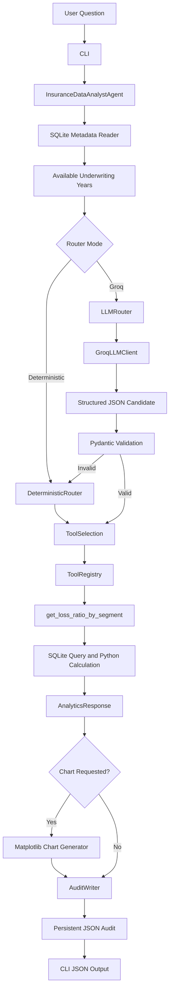

# System Architecture

## Purpose

This document describes the architecture of the **Insurance Data Analyst Agent**.

The application answers selected analytical questions about a synthetic insurance portfolio. It routes a question to an explicitly authorized tool, validates all tool arguments, runs deterministic SQLite and Python calculations, optionally generates a chart, and persists a complete JSON audit artifact.

The project demonstrates a controlled analytical-agent design for insurance portfolio exploration. It is not a production underwriting, pricing, claims, reserving, or coverage-determination system. It is Project 2 of a five-project insurance agentic AI portfolio, alongside a submission extractor, a knowledge/RAG agent, an underwriting agent, and a Docker Compose orchestration layer.

## Design Goals

- **Controlled tool use:** the application executes only allow-listed analytical tools.
- **Deterministic calculations:** business metrics are calculated in Python and SQLite, not by the LLM.
- **Validated inputs:** tool names, dimensions, years, provinces, and lines of business are validated with Pydantic.
- **Auditability:** every execution records the question, routing result, tool calls, arguments, raw results, response, and errors where applicable.
- **Reproducibility:** synthetic data is generated from an explicit seed and stored locally in SQLite.
- **Provider independence:** provider-specific SDK code is isolated behind an `LLMClient` contract.
- **Safe fallback:** the deterministic router remains available when an LLM provider fails or returns invalid output.
- **Controlled visualization:** charts are generated by Python from approved metadata and analytical results.

## High-Level Architecture



The route to a tool is controlled before calculation begins. The LLM may propose a structured tool selection, but it cannot directly execute SQL, Python code, shell commands, arbitrary functions, or external actions.

## Main Components

| Component | Responsibility | Provider-specific |
|---|---|---:|
| `cli.py` | Parses commands, builds dependencies, returns JSON or controlled errors | No |
| `config.py` | Loads validated runtime settings from environment variables | No |
| `database.py` | Retrieves controlled metadata from the SQLite portfolio database | No |
| `models/analytics.py` | Defines analytical requests, responses, metrics, chart metadata, and validation rules | No |
| `models/routing.py` | Defines the validated `ToolSelection` contract | No |
| `models/audit.py` | Defines persistent audit-record contracts | No |
| `services/router.py` | Implements deterministic question routing and filter extraction | No |
| `services/llm_router.py` | Validates LLM output and applies deterministic fallback | No |
| `services/agent.py` | Orchestrates routing, tool execution, response building, chart generation, and auditing | No |
| `services/response_builder.py` | Builds structured user-facing analytical responses | No |
| `services/audit_writer.py` | Writes versioned JSON audit artifacts | No |
| `tools/base.py` | Defines the base tool contract used by the registry | No |
| `tools/registry.py` | Maintains the allow-list of analytical tools and executes registered handlers | No |
| `tools/loss_ratio.py` | Implements the paid loss-ratio calculation | No |
| `charts.py` | Generates approved chart types from results and chart metadata | No |
| `llm/base.py` | Defines the provider-agnostic `LLMClient` protocol | No |
| `llm/fake.py` | Provides deterministic LLM behavior for tests | No |
| `llm/groq_client.py` | Implements the `LLMClient` contract using the Groq SDK | Yes |
| `llm/prompts.py` | Defines router-facing prompt templates | No |
| `synthetic_data/generator.py` | Builds the reproducible synthetic SQLite dataset | No |

## Data Architecture

The V1 portfolio is stored in a local SQLite database (`data/insurance_portfolio.db`) generated from a deterministic seed, with `policies` and an aggregated claims relation joined by `policy_id` and filtered by province, line of business, and underwriting year.

## Tool Registry Control

The registry maps each authorized tool name to an explicitly registered Python handler. The application rejects duplicate registrations and unknown tool names.

```text
ToolSelection
    ↓
ToolRegistry.get(tool_name)
    ↓
RegisteredTool.handler
    ↓
Deterministic analytical function
```

No router, user input, LLM response, or prompt can provide a Python import path, function name outside the allow-list, or SQL statement for execution.

## Loss-Ratio Calculation

```text
paid_loss_ratio = total_paid_claim_amount / total_written_premium
```

1. Aggregate paid claim amounts at the `policy_id` level.
2. Join the aggregated claim amount to policies.
3. Apply validated underwriting-year, province, and line-of-business filters.
4. Group results using only allow-listed dimensions.
5. Aggregate written premium and paid claim amount.
6. Calculate the ratio with a zero-denominator guard.

The claim aggregation before the policy join prevents a one-to-many relationship between policies and claims from duplicating written premium in the denominator:

```text
Incorrect pattern
policies LEFT JOIN claims
    ↓
A policy with two claims may contribute premium twice

Controlled pattern
claims aggregated by policy
    ↓
policies LEFT JOIN claims_by_policy
    ↓
Each policy contributes premium once
```

## Response and Chart Contract

`AnalyticsResponse` includes the original question, tool calls and validated arguments, raw analytical rows, a deterministic explanation, chart metadata, and audit metadata.

```text
AnalyticsResponse.chart metadata
    ↓
charts.generate_chart(...)
    ↓
Matplotlib PNG file
```

The router and LLM never generate Matplotlib code directly. They can only select predefined metadata represented by the Pydantic model. V1 supports a single allow-listed `grouped_bar` chart type.

## Audit Architecture

Every invocation of `InsuranceDataAnalystAgent.answer()` produces an `AgentRunAudit` JSON artifact in `output/audits/`.

### Successful audit

```text
run_id
timestamp_utc
agent_version
dataset_version
database_path
question
status = success
tool_calls
raw_results
final_response
```

### Failed audit

```text
run_id
timestamp_utc
agent_version
dataset_version
database_path
question
status = failed
error.error_type
error.message
```

If an error occurs after tool selection, the audit preserves the validated tool arguments and marks the tool call as failed. Audit files are written through a temporary file and replacement step to reduce the risk of leaving incomplete JSON artifacts.

## Configuration and Secrets

```dotenv
DATABASE_PATH=data/insurance_portfolio.db
AUDIT_DIRECTORY=output/audits
DATASET_VERSION=synthetic-v1

GROQ_API_KEY=
GROQ_MODEL=
```

### Tracked by Git

```text
Source code, tests, synthetic data generator, documentation,
evaluation fixtures, .env.example, pyproject.toml, uv.lock,
GitHub Actions workflow
```

### Never tracked by Git

```text
.env, API keys, provider credentials, real policyholder information,
real claims data, confidential policy or underwriting data,
locally generated database files when not intended as fixtures,
generated audit files, generated charts
```

## Failure Handling

| Condition | Required behavior |
|---|---|
| Empty question | Raise a controlled unsupported-question error |
| Unsupported analytical intent | Reject without executing a tool |
| Requested year unavailable in the database | Reject rather than substitute another year |
| Missing database | Raise a controlled file error and persist a failed audit |
| Unknown tool | Raise `ToolNotFoundError` |
| Invalid LLM JSON | Fall back to deterministic routing |
| Invalid LLM tool name | Fall back to deterministic routing |
| Invalid LLM filter value | Fall back to deterministic routing |
| Provider request failure | Fall back to deterministic routing |
| Empty analytical result for chart generation | Reject chart creation and persist failed context |
| Unsupported chart type | Reject chart creation and persist failed context |

The fallback router does not make unsupported metrics available. If both the LLM route and deterministic route cannot handle a question, the application returns a controlled error instead of inventing an answer.

## Quality Strategy

| Test layer | Purpose |
|---|---|
| Unit tests | Validate models, router helpers, database helpers, chart generation, audit writing, and provider adapters in isolation |
| Calculation-integrity tests | Detect premium duplication and confirm metric formulas |
| Registry tests | Confirm only registered tools execute |
| CLI tests | Validate commands, standard output, standard error, and exit behavior |
| Agent tests | Validate complete orchestration with a temporary SQLite database and temporary audit directory |
| Router evaluation cases | Validate English/French question handling, expected arguments, and controlled rejection cases |
| LLM-router tests | Validate provider output validation and deterministic fallback using `FakeLLMClient` |
| CI | Run formatting, linting, tests, and coverage checks for every push and pull request |

```text
uv sync --locked
ruff format --check
ruff check
pytest
coverage threshold
```

## Extensibility

### Planned V1.1 tools

```text
get_claim_frequency_trend
get_exposure_summary
get_portfolio_quality_metrics
```

Each new tool should add: a Pydantic request contract, deterministic Python/SQLite calculation logic, registry registration, router vocabulary and evaluation cases, calculation-integrity tests, response-builder support, chart metadata and rendering support when relevant, and documentation of metric definitions and limitations.

### Future delivery interfaces

Because CLI concerns are separated from orchestration, the same `InsuranceDataAnalystAgent` can later be used by a FastAPI API, a Streamlit interface, a notebook demonstration, a scheduled reporting job, or the broader Underwriting Agent workflow.

## Current Limitations

- V1 supports only paid loss-ratio analysis.
- Premium is written premium, not earned premium.
- Claims use paid amounts only and do not model case reserves, incurred losses, ultimate losses, or development.
- The data is synthetic and not representative of any production insurer.
- Accident-year, calendar-year, reserving, and triangle analyses are outside the V1 scope.
- The deterministic router recognizes a limited English and French vocabulary.
- The Groq adapter supports routing assistance only; it does not perform insurance calculations.
- A real external provider requires locally configured credentials and should not be part of deterministic CI tests.

## Recommended Technology Upgrades

| Area | Current | Recommended | Benefit |
|---|---|---|---|
| Observability | No tracing | Langfuse or OpenTelemetry around `agent.answer()` | Visibility into routing decisions, fallback triggers, and per-run cost |
| Persistence | SQLite + flat JSON audits | PostgreSQL with SQLAlchemy 2.0 async | Shared, queryable audit history across the platform |
| API layer | CLI only | FastAPI endpoint wrapping the agent (already on the V2 roadmap) | Enables direct calls from the Underwriting Agent |
| Routing validation | Pydantic + deterministic fallback | Pydantic AI or constrained decoding | Fewer invalid LLM candidates before the fallback path triggers |
| Visualization | Matplotlib static PNG | Plotly for the planned Streamlit UI | Interactive charts for the V2 analytics interface |

## Improvements and Next Steps

1. Implement the V1.1 tools (`get_claim_frequency_trend`, `get_exposure_summary`, `get_portfolio_quality_metrics`) following the documented extensibility checklist.
2. Add a Google Gemini adapter implementing `LLMClient` to reduce reliance on a single external provider.
3. Instrument `agent.answer()` with tracing to capture router mode, fallback events, and latency per execution.
4. Migrate audit persistence from flat JSON files to PostgreSQL for cross-project analytics with Project 1.
5. Build the FastAPI endpoint planned for V2 so the Underwriting Agent can call this service directly.

## Agentic AI Best Practices Applied Here

- **Allow-listed tool execution**: only `get_loss_ratio_by_segment` can be invoked; no arbitrary function, SQL, or shell command is reachable from user or LLM input.
- **LLM as an untrusted proposer, not an executor**: `ToolSelection` output is fully revalidated before execution, with deterministic fallback on any invalid or unavailable response.
- **Deterministic calculation core**: financial metrics are computed exclusively in Python/SQLite, keeping numeric outputs reproducible and auditable.
- **Fail-safe over fail-open**: when neither routing path can answer a question, the system returns a controlled error instead of fabricating a response.
- **Full-run auditability**: every execution, successful or failed, is persisted with inputs, validated arguments, raw results, and errors, matching 2026 production-agent guidance on replayable agent runs.
- **Next practice to adopt**: expose this agent as an MCP-compatible tool so the Underwriting Agent or a future orchestrator can call `get_loss_ratio_by_segment` through a standardized tool contract instead of a CLI wrapper.
